# Ekaro — Architecture overview

## System context

```mermaid
flowchart LR
  U[Browser SPA<br/>apps/web] -->|HTTPS /api/v1| A[NestJS API<br/>apps/api]
  A --> DB[(PostgreSQL 16<br/>RLS per tenant)]
  A --> R[(Redis<br/>cache, throttling, BullMQ)]
  W[Worker<br/>apps/api worker.ts] --> DB
  W --> R
  W --> GSP[GSP API]
  W --> MAIL[Email]
  W --> S3[Object storage]
  TC[Tally connector<br/>customer PC] -->|HTTPS poll| A
```

## Request lifecycle (tenant route)

1. `helmet`, CORS, request id (`x-request-id`), Pino HTTP log.
2. `JwtAuthGuard` verifies the access token, which puts `{ userId, tenantId, membershipId, sessionId }` in CLS.
3. `PermissionGuard` checks `@RequirePermission` against the membership's role permissions (Redis-cached).
4. `ZodValidationPipe` parses params, query and body with the contracts schema.
5. `TenantTxInterceptor` opens a DB transaction as `ekaro_app` and runs `set_config('app.tenant_id'|'app.user_id'|'app.request_id', …, true)`.
6. Controller → service → repositories (through `TransactionHost`) → posting engine / events / outbox.
7. Commit. The audit trigger rows are written as part of the same transaction.
8. `ProblemDetailsFilter` maps errors to RFC 9457.

## Module map (`apps/api/src/modules`)

| Module          | Owns                                                                                                                                            | Sprint |
| --------------- | ----------------------------------------------------------------------------------------------------------------------------------------------- | ------ |
| `platform`      | tenants, signup, plans, feature flags, support consent                                                                                          | 1      |
| `auth`          | users, credentials, sessions / refresh tokens, 2FA, Google sign-in                                                                              | 1      |
| `access`        | roles, permissions, memberships, branch scope, invitations                                                                                      | 1      |
| `audit`         | audit_log query API (writes come from the DB trigger)                                                                                           | 1      |
| `masters`       | company profile and settings, branches, godowns, units + conversions, tax rates, item categories, items, parties (+ addresses), document series | 1      |
| `approvals`     | approval rules (PL-03), approval requests, decisions                                                                                            | 2      |
| `posting`       | stock ledger, valuation layers, GL entries, period locks                                                                                        | 2      |
| `inventory`     | transfers, adjustments, batches, stock count, reorder                                                                                           | 2      |
| `purchase`      | PR, PO, GRN, purchase invoice (3-way match), returns / debit notes                                                                              | 2      |
| `sales`         | quotation, SO, delivery challan, invoice, returns / credit notes, credit-limit check                                                            | 3      |
| `accounts`      | chart of accounts, vouchers, bill-wise settlement, bank reco, FY close                                                                          | 3      |
| `documents`     | PDF rendering, attachments, email sending                                                                                                       | 3      |
| `production`    | BOM, work orders, material issue, output / scrap, job work (ITC-04)                                                                             | 4      |
| `gst`           | GSP port, e-invoice, e-way bill, GSTR-1 / 3B data, 2B reconciliation                                                                            | 4–5    |
| `imports`       | Excel templates / import, Tally masters import, full export                                                                                     | 5      |
| `tally-sync`    | voucher push to the Tally connector                                                                                                             | 5      |
| `reports`       | dashboard, stock / sales / purchase reports, P&L, BS, TB, day book                                                                              | 5      |
| `notifications` | email notifications (approvals, low stock, overdue)                                                                                             | 5      |

## Web map (`apps/web/src`)

`routes/(auth)/login|signup`, `routes/_app/` (authenticated shell with sidebar, top bar with tenant/branch/FY switcher and global search), `features/<module>/…` mirroring the API modules.

## Environments

`local` (docker compose: postgres, redis, mailpit, minio) → `staging` → `production`. Everything is hosted in an India region with managed Postgres, daily full backups plus WAL (PITR) and 30-day retention (BRD §10).
