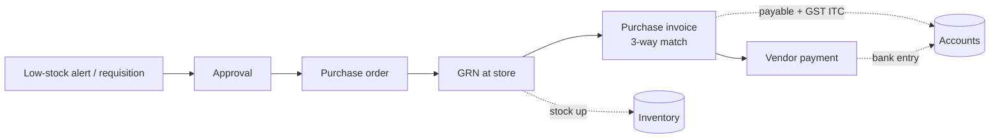
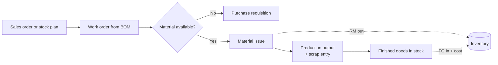
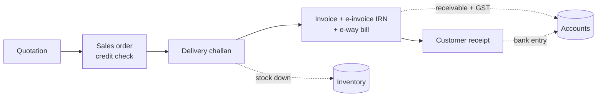
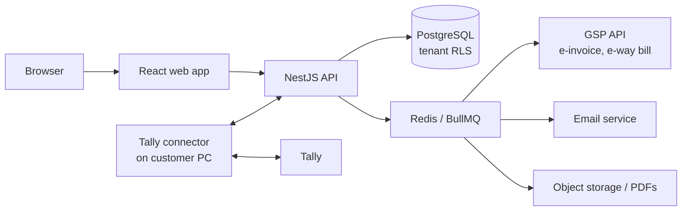

# Ekaro — Business Requirements Document (BRD)

Sep 26, 2026 · @Ayush Raiyani

## 1. Executive summary

Ekaro is a cloud ERP for Indian MSMEs that puts inventory, purchase, sales, production and GST accounting in one web app. A company can go live in one day and pays per user, at a fraction of the cost of big ERPs.

Every purchase, production entry and sale posts to stock and accounts automatically. Owners get live numbers instead of month-end surprises, and accountants get GST-ready data without re-typing. Tally users can either switch fully or keep Tally and sync.

V1 targets launch in about 3 months (late December 2026), built by the founder with 2–3 hired helpers.

| Item | Detail |
| --- | --- |
| Product | Ekaro (working name, pending trademark and domain check) |
| Type | Multi-tenant SaaS ERP, web app |
| Market | Indian MSMEs: manufacturers (5–500 staff), traders, distributors |
| Owner | Ayush (founder) |
| Relation to Sunchaser | None — independent venture |
| Version | 0.1 draft |
| V1 target | Late December 2026 |

## 2. Purpose, vision and mission

**Tagline:** *Ek system. Poora business.* (One system. Your whole business.)

**Purpose.** Give every Indian MSME the control and visibility that large companies get from SAP, at the price of a monthly phone bill.

**Vision.** Become the default operating system for Indian small and mid-size businesses — the first software a new factory or trading firm installs.

**Mission.** Replace the Tally + Excel + WhatsApp chaos with one simple, affordable, GST-ready system that a company can start using in one day.

**Values that guide product decisions**

- **Simple beats complete.** A feature ships only if a store keeper can use it without training.
- **Value on day one.** Every new customer sends a real GST invoice on their first day.
- **Compliant by default.** GST rules are built in, not bolted on.
- **Honest pricing.** Per-user, published, no hidden implementation fees.
- **Customer owns the data.** Full export anytime, no lock-in.

## 3. Problem statement — why Ekaro exists

Most Indian MSMEs run on Tally for accounts, Excel for stock and WhatsApp for orders. Nobody knows real stock, cost or profit until the accountant closes the month.

| # | Problem | What happens today | Business impact |
| --- | --- | --- | --- |
| 1 | Data in 10 places | Tally, Excel sheets, registers, WhatsApp chats, other apps | Same entry typed 3–4 times; errors; no single source of truth |
| 2 | Big ERPs cost too much | SAP B1, Oracle or custom Odoo need months and lakhs to implement | MSMEs can't afford them, or abandon them halfway |
| 3 | No real-time visibility | Stock and work-in-progress counted by hand | Stock-outs, dead stock, missed delivery dates |
| 4 | GST compliance headache | E-invoice, e-way bill and returns done in separate portals | Penalties, heavy CA dependency, hours lost every month |
| 5 | Fear of migration | Years of data locked in Excel and Tally | Owners stay with the old way even when it hurts |

**Why now.** E-invoicing now covers many mid-size businesses, owners are comfortable with cloud and UPI, and a new generation is taking over family businesses and wants modern tools.

## 4. Target market and personas

Ekaro serves all MSMEs long-term, but launches with one beachhead: small manufacturers and traders in Gujarat, starting with Rajkot, where the founder can meet customers in person.

| Segment | Key needs | Launch priority |
| --- | --- | --- |
| Small manufacturers (5–50 staff) | BOM, job work, stock, GST billing | P1 — beachhead |
| Traders, distributors, wholesalers | Fast billing, multi-godown stock, receivables | P1 — beachhead |
| Mid-size manufacturers (50–500 staff) | Production planning, approvals, multi-branch | P2 — after 20 paying customers |
| Any MSME (services, retail) | Basic stock + GST accounts | P3 — later |

### Personas

| Persona | Who | What they want from Ekaro |
| --- | --- | --- |
| Owner / Director | Runs the business, decides the purchase | Live cash, stock, receivables and profit on one screen |
| Accountant | Handles books and GST, usually Tally-trained | Keyboard-fast entry, GST returns data, Tally sync |
| Store keeper | Receives and issues material | Simple in/out entries, barcode, low-stock alerts |
| Purchase executive | Buys raw material | Reorder list, POs, vendor rate history |
| Sales executive | Takes orders, sends quotes | Quick quotations, stock check, order status |
| Production supervisor | Runs the shop floor | Work orders, material issue, output and scrap entry |
| External CA | Files returns for the client | Read-only access, GSTR data exports |

## 5. Solution and key differentiators

Ekaro's core idea is **enter once, see everywhere**: a goods receipt updates stock and the vendor ledger, a production entry consumes raw material and adds finished goods, and a sales invoice reduces stock, posts to accounts and generates the e-invoice.

| # | Key feature | Why it wins |
| --- | --- | --- |
| 1 | One-day go-live | Setup wizard, industry templates, Excel and Tally import — no consultant needed |
| 2 | GST built in | E-invoice (IRN + QR), e-way bill, GSTR-1 and GSTR-3B ready data from day one |
| 3 | Tally, your way | Replace Tally fully, or keep it and sync vouchers automatically |
| 4 | Live owner dashboard | Stock value, receivables, payables, cash, production status in real time |
| 5 | Keyboard-first entry | Tally-style shortcuts so accountants switch without slowing down |
| 6 | Shop-floor simple screens | Big buttons and few fields for store and production staff |
| 7 | Fair per-user pricing | Pay only for users who enter data; CA and view-only users free |
| 8 | Your data, always | One-click full export to Excel; no lock-in |

## 6. V1 scope

V1 ships six business modules plus the platform layer, as a web app in English. Everything else waits for Phase 2 or later.

| Module | In V1 | Later |
| --- | --- | --- |
| Masters & setup | Company, GSTIN, branches, godowns, items, parties, units, tax rates | Multi-company consolidation |
| Inventory | Stock ledger, transfers, adjustments, batches, low-stock alerts | Serial numbers, bin locations, barcode printing |
| Purchase | PR, PO, GRN, purchase invoice, returns | Vendor portal, RFQ comparison |
| Sales | Quotation, sales order, delivery challan, invoice, returns | Customer portal, price lists by region |
| Production | BOM, work order, material issue, output, scrap, job work | MRP, capacity planning, shop-floor tablets |
| Accounts & GST | Ledgers, vouchers, bank, receivables, payables, e-invoice, e-way bill, GSTR-1/3B data | TDS/TCS returns, bank feeds, direct GSTR filing |
| Tally & import | Excel import, Tally masters + opening import, Tally voucher sync | Two-way live Tally sync |
| Reports & dashboard | Owner dashboard, stock, sales, purchase, P&L, balance sheet | Custom report builder |
| Platform | Users, roles, approvals, audit log, email notifications | WhatsApp notifications, public API |

**Out of scope for V1:** mobile app, offline mode, Hindi/Gujarati UI, HR and payroll, CRM, quality control, POS, multi-currency and export documentation.

## 7. Functional requirements

Priority: **Must** = V1 launch blocker, **Should** = V1 if time allows, else first update.

### 7.1 Masters and setup

| ID | Requirement | Priority |
| --- | --- | --- |
| MS-01 | Sign up with GSTIN; auto-fill legal name, address and state | Must |
| MS-02 | Item master: code, name, HSN, GST rate, UoM with conversions, category, reorder level | Must |
| MS-03 | Party master: customers and vendors with GSTIN, credit limit, payment terms | Must |
| MS-04 | Multiple branches and godowns per company | Must |
| MS-05 | Document numbering series per branch and financial year | Must |
| MS-06 | Industry templates (engineering, fabrication, trading, food) pre-load items, accounts and settings | Should |

### 7.2 Inventory

| ID | Requirement | Priority |
| --- | --- | --- |
| IN-01 | Real-time stock by item, godown and batch | Must |
| IN-02 | Stock transfer between godowns and branches | Must |
| IN-03 | Stock adjustment with reason and approval | Must |
| IN-04 | Valuation by FIFO or weighted average | Must |
| IN-05 | Low-stock alerts and reorder suggestions | Must |
| IN-06 | Batch and expiry tracking | Should |
| IN-07 | Physical stock count with variance report | Should |

### 7.3 Purchase

| ID | Requirement | Priority |
| --- | --- | --- |
| PU-01 | Purchase requisition → approval → purchase order | Must |
| PU-02 | GRN against PO with partial receipts and rejection quantity | Must |
| PU-03 | Purchase invoice matched to PO and GRN (3-way match) | Must |
| PU-04 | Purchase return and debit note | Must |
| PU-05 | Vendor rate history and last-purchase-price hint | Should |

### 7.4 Sales

| ID | Requirement | Priority |
| --- | --- | --- |
| SA-01 | Quotation → sales order → delivery challan → invoice | Must |
| SA-02 | Direct invoice for counter or trading sales | Must |
| SA-03 | Credit-limit check with override approval | Must |
| SA-04 | Sales return and credit note | Must |
| SA-05 | Invoice PDF with company branding, sent by email | Must |
| SA-06 | Pending-order and pending-dispatch reports | Should |

### 7.5 Production

| ID | Requirement | Priority |
| --- | --- | --- |
| PR-01 | Multi-level BOM with scrap percentage | Must |
| PR-02 | Work order from sales order or for stock | Must |
| PR-03 | Material issue against work order; shortage check | Must |
| PR-04 | Production output entry with scrap and rejection | Must |
| PR-05 | Job work: send material out, receive processed goods (GST ITC-04 data) | Must |
| PR-06 | Work order costing: material + labour + overhead vs. standard | Should |

### 7.6 Accounts and GST

| ID | Requirement | Priority |
| --- | --- | --- |
| AC-01 | Chart of accounts with Indian defaults; ledger groups like Tally | Must |
| AC-02 | Vouchers: payment, receipt, contra, journal, sales, purchase, debit and credit note | Must |
| AC-03 | Auto-posting from purchase, sales and production documents | Must |
| AC-04 | Receivables and payables ageing; bill-by-bill settlement | Must |
| AC-05 | Bank reconciliation (statement upload) | Must |
| AC-06 | E-invoice: generate IRN and QR via GSP; cancel within allowed window | Must |
| AC-07 | E-way bill generation from invoice or challan | Must |
| AC-08 | GSTR-1 and GSTR-3B data export; GSTR-2B reconciliation | Must |
| AC-09 | Trial balance, P&L, balance sheet, day book | Must |
| AC-10 | Financial-year close and opening balance carry-forward | Must |
| AC-11 | TDS deduction on vendor payments | Should |

### 7.7 Tally and data import

| ID | Requirement | Priority |
| --- | --- | --- |
| TI-01 | Excel templates for items, parties, opening stock and balances; row-level error report | Must |
| TI-02 | Import masters and opening balances from Tally | Must |
| TI-03 | Sync mode: push Ekaro vouchers to Tally on a schedule | Must |
| TI-04 | Full data export to Excel anytime | Must |

### 7.8 Dashboard, reports and platform

| ID | Requirement | Priority |
| --- | --- | --- |
| PL-01 | Owner dashboard: sales, purchase, cash, receivables, payables, stock value, open work orders | Must |
| PL-02 | Every report filterable by date, branch, party, item; export to Excel and PDF | Must |
| PL-03 | Configurable approval rules by document type and amount | Must |
| PL-04 | Audit log of every create, edit and delete with old and new values | Must |
| PL-05 | Email notifications for approvals, low stock, overdue payments | Must |
| PL-06 | Global search across documents, items and parties | Should |

## 8. User roles and permissions

Ekaro ships nine default roles; the owner can clone and edit any of them. Access is scoped by module, action (view, create, edit, delete, approve) and branch.

### 8.1 Customer-side roles

| Role | Access | Billable |
| --- | --- | --- |
| Owner (super admin) | Everything, billing, user management | Yes |
| Admin | Everything except billing and deleting the company | Yes |
| Accountant | Accounts, GST, bank, all financial reports; view other modules | Yes |
| Purchase | Requisitions, POs, vendor masters; view stock | Yes |
| Sales | Quotations, orders, invoices, customer masters; view stock | Yes |
| Store | GRN, issues, transfers, stock adjustments (needs approval) | Yes |
| Production | BOM, work orders, material issue, output entry | Yes |
| CA (external) | Read-only accounts and GST reports, exports | Free |
| Viewer | Read-only dashboards and reports | Free |

### 8.2 Ekaro-side roles

| Role | Access |
| --- | --- |
| Platform super admin | Tenants, plans, billing, feature flags |
| Support agent | Read a tenant's data only with the customer's time-limited consent; every action logged |
| Implementation partner | Setup and import for assigned tenants only |

**Rules:** approvals follow amount limits (e.g. POs above ₹50,000 need owner approval); a user never approves their own document; posted financial documents are never deleted, only cancelled with a reversal entry.

## 9. Core business process flows

Three flows carry the whole business; each step updates stock and accounts automatically.

### 9.1 Procure to pay

### 9.2 Plan to produce

### 9.3 Order to cash

### 9.4 Document status lifecycle

| Status | Meaning | Allowed next |
| --- | --- | --- |
| Draft | Being prepared, no effect on stock or accounts | Submitted, Deleted |
| Submitted | Waiting for approval | Approved, Rejected |
| Approved | Ready to act on | Posted, Cancelled |
| Posted | Stock and ledgers updated | Cancelled (with reversal) |
| Cancelled | Reversed; kept for audit | — |

## 10. Non-functional requirements

| Area | Requirement |
| --- | --- |
| Performance | Pages load in under 2 s; invoice save under 1 s at 50 concurrent users per tenant |
| Availability | 99.5% monthly uptime; planned maintenance only 11 pm–5 am IST |
| Data residency | All customer data stored in India |
| Security | HTTPS everywhere, bcrypt passwords, optional 2FA, tenant isolation enforced in the database |
| Backup | Daily full + continuous WAL backup; 30-day retention; restore tested monthly |
| Audit | Every change logged with user, time, old and new value; logs kept 8 years (books-of-account rule) |
| Accuracy | Stock and ledger totals always reconcile; nightly integrity check job |
| Browsers | Latest Chrome, Edge, Firefox; usable on 1366×768 screens |
| Scalability | 1,000 tenants on the launch infrastructure without redesign |
| Compliance | Indian GST rules, e-invoice schema, DPDP Act 2023 for personal data |

## 11. Technical architecture — how we build it

Ekaro is a modular monolith on the founder's proven stack, so a small team can ship fast and split services later only if needed.

| Layer | Choice | Why |
| --- | --- | --- |
| Frontend | React + TypeScript, component library, keyboard-shortcut layer | Fast data-entry screens; one language across the stack |
| Backend | NestJS modular monolith (one module per business area) | Clear boundaries without microservice overhead |
| Database | PostgreSQL, shared schema with `tenant_id` + row-level security | Cheap per tenant, strong isolation |
| Jobs | Redis + BullMQ | E-invoice calls, Tally sync, reports, emails run in background |
| Documents | Server-side PDF generation; object storage for files | Branded invoices, attachments |
| GST | Licensed GSP/ASP API for e-invoice, e-way bill and GSTIN lookup | Direct government API access needs GSP licensing |
| Tally | Small Windows connector talking to Tally's XML interface | Tally runs on the customer's PC, not in the cloud |
| Auth | JWT sessions, optional 2FA, Google sign-in | Simple and secure |
| Hosting | Docker on an India-region cloud; managed Postgres | Data residency, easy scaling |
| Observability | Centralised logs, metrics, error tracking, uptime alerts | Catch issues before customers do |

**Design rules:** every stock and ledger movement goes through one posting engine; money stored as integer paise; all documents immutable once posted; each business module exposes events other modules subscribe to.

## 12. Pricing and business model

Ekaro charges per active user per month, with three tiers and free read-only users. The prices below are starting proposals to validate with the first 10 customers.

| Plan | Price (₹/user/month, billed yearly) | Includes | Best for |
| --- | --- | --- | --- |
| Starter | 399 | Inventory, purchase, sales, GST billing, e-invoice, e-way bill, Tally sync | Traders, very small units |
| Growth | 699 | Starter + production, full accounts, bank reconciliation, approvals | Small manufacturers |
| Pro | 999 | Growth + multi-branch, advanced costing, priority support | Mid-size manufacturers |

- **Free users:** CA and viewer roles never count toward billing.
- **Minimum:** 2 billable users per company.
- **Monthly billing:** 20% higher than yearly.
- **Trial:** 14 days, full Growth features, no card needed.
- **E-invoice volume:** first 500 IRNs per month included; small top-up fee beyond that (covers GSP cost).

### Assisted setup (one-time)

| Package | Price (₹) | What we do |
| --- | --- | --- |
| Quick start | 9,999 | Remote: import masters and opening balances, 2 training calls |
| Full setup | 29,999 | Data clean-up, Tally history import, BOM setup, role design, 1 week hand-holding |
| On-site (Gujarat) | 49,999 | Full setup + 2 days on-site training |

**Example:** a 5-user manufacturer on Growth pays ₹3,495 per month (₹41,940 per year), plus optional one-time setup.

## 13. Onboarding, migration and implementation

The goal is a real GST invoice within 60 minutes of sign-up for self-serve customers, and full go-live within 1 week for assisted ones.

### 13.1 Self-serve path

1. Sign up with mobile, email and GSTIN; company details auto-fill.
2. Pick an industry template; it loads units, item categories, ledgers and settings.
3. Import items and parties from the Excel template (or from Tally).
4. Enter opening stock and opening balances.
5. Invite team members and assign roles.
6. Create the first invoice; the e-invoice and e-way bill are generated in the same step.

A progress checklist on the dashboard shows what is left, and in-app videos (2 minutes each) explain every step.

### 13.2 Migration rules

- Excel import validates every row and returns a downloadable error file; nothing half-imports.
- Tally import brings masters, opening balances and, in Full setup, up to 2 years of vouchers.
- A parallel-run mode lets customers keep Tally for one month while Ekaro syncs vouchers into it.
- Go-live checklist: stock and trial balance in Ekaro match the old system before the switch.

## 14. Competitive landscape

Ekaro's gap: tools that are cheap are weak in production, and tools strong in production are costly and slow to implement. Positioning is based on general market knowledge and should be re-checked before launch.

| Competitor | Strength | Where Ekaro wins |
| --- | --- | --- |
| Tally Prime | Trusted by accountants, strong GST | Desktop-first; weak production and live multi-user visibility |
| Busy / Marg | Popular with traders and distributors | Dated UI; limited manufacturing depth |
| Vyapar | Very cheap, mobile billing | Built for tiny shops; no real production or approvals |
| Zoho Inventory / Books | Modern cloud, good integrations | Manufacturing is thin; several separate apps |
| Odoo | Very complete | Needs a partner, months of setup, costs add up |
| SAP Business One | Enterprise grade | Far too costly and heavy for MSMEs |
| [UdyogERP](https://www.capterra.co.nz/software/177689/udyog-erp) | Indian SME ERP incl. manufacturing and tax compliance | Older product; Ekaro competes on setup speed and UX |
| [Kladana](https://www.kladana.com/blog/business/best-manufacturing-software/) | Cloud manufacturing + inventory for India | Ekaro adds Tally sync and full accounting (verify their depth) |

## 15. Team, 3-month plan and roadmap

The full V1 scope in 12 weeks needs a small paid team from week 1, and the founder working as product owner and tech lead rather than writing every line.

### 15.1 Team

| Role | Who | Commitment |
| --- | --- | --- |
| Product owner + tech lead | Ayush | Evenings + weekends; architecture, posting engine, reviews |
| Full-stack developer 1 | Hire / contract | Full-time: inventory, purchase, sales |
| Full-stack developer 2 | Hire / contract | Full-time: production, accounts |
| GST / accounts consultant (CA) | Part-time | Validates accounting logic and GST flows every sprint |
| UI/UX designer | Freelance | Weeks 1–3: design system and key screens |
| QA tester | Freelance | Weeks 8–12 |

### 15.2 V1 plan (six 2-week sprints, starting October 2026)

| Sprint | Weeks | Deliverable |
| --- | --- | --- |
| 1 | 1–2 | Architecture, multi-tenancy, auth, roles, masters, UI kit |
| 2 | 3–4 | Inventory, posting engine, purchase cycle |
| 3 | 5–6 | Sales cycle, invoice PDFs, chart of accounts, vouchers |
| 4 | 7–8 | Production (BOM, work orders, job work), GSP integration |
| 5 | 9–10 | GST reports, bank reco, dashboard, Excel + Tally import, Tally sync |
| 6 | 11–12 | Pilot with 3 friendly customers, bug fixing, billing, launch |

**Scope guard:** if a sprint slips, "Should" items move to the first update; launch never slips for them.

### 15.3 Roadmap after V1

| Phase | Timing | Focus |
| --- | --- | --- |
| Phase 2 | Q1–Q2 2027 | Android app, Hindi + Gujarati UI, WhatsApp invoices and payment reminders, barcode |
| Phase 3 | H2 2027 | HR and payroll, CRM, quality control, customer and vendor portals, public API |
| Phase 4 | 2028 | AI: reorder forecasting, cash-flow prediction, ask-your-data reports |

## 16. Risks and mitigations

The biggest risk is the timeline: full V1 in 3 months with a part-time founder is aggressive.

| Risk | Likelihood | Impact | Mitigation |
| --- | --- | --- | --- |
| 3-month timeline slips | High | High | Hire both developers in week 1; strict Must/Should split; weekly demo |
| Accounting or GST bugs | Medium | Very high | CA reviews every sprint; automated ledger-balance tests; pilot before public launch |
| Founder bandwidth (day job) | High | High | Founder owns architecture and reviews only; clear written specs per sprint |
| GSP cost or downtime | Medium | Medium | Abstract the GSP behind one interface; keep a second GSP option ready |
| Tally sync edge cases | Medium | Medium | Start with one-way push; limited voucher types in V1 |
| Low willingness to pay | Medium | High | Validate pricing with 10 owners before launch; free CA users as a referral channel |
| Data breach across tenants | Low | Very high | Row-level security, isolation tests in CI, security review before launch |
| Name or trademark conflict | Medium | Medium | IP India search and domain check before any branding spend |

## 17. Success metrics

Success in the first 6 months after launch means 25 paying companies who use Ekaro daily and stay.

| Metric | Target | Measured |
| --- | --- | --- |
| Paying companies | 3 pilots at launch; 25 by month 6 | Monthly |
| Activation | 60% of sign-ups send a GST invoice on day 1 | Weekly |
| Trial to paid | 15% or higher | Monthly |
| Monthly logo churn | Below 3% | Monthly |
| Daily active use | 70% of paying companies post a document every working day | Weekly |
| Time to go-live (assisted) | 7 days or less | Per customer |
| Uptime | 99.5% or higher | Monthly |
| Customer satisfaction (NPS) | 40 or higher | Quarterly |

## 18. Assumptions and open decisions

### Assumptions

- Customers have reliable internet at the office; offline mode is not needed for V1.
- English UI is acceptable for owners and accountants in the beachhead segment.
- A licensed GSP can be contracted within the first 4 weeks.
- Budget exists for 2 developers and a part-time CA for 3 months.

### Open decisions

- [ ] Final product name — Ekaro is a working name; run IP India trademark search (classes 9 and 42) and check ekaro.com / ekaro.in
- [ ] Register the business entity and its own GSTIN for billing customers
- [ ] Check the Sunchaser employment contract for side-business, IP and non-compete clauses before building
- [ ] Choose the GSP/ASP partner after comparing API pricing and uptime
- [ ] Choose cloud provider and India region
- [ ] Validate pricing with 10 target owners
- [ ] Confirm beachhead: Rajkot manufacturers + traders
- [ ] Hire 2 developers and 1 part-time CA before sprint 1
